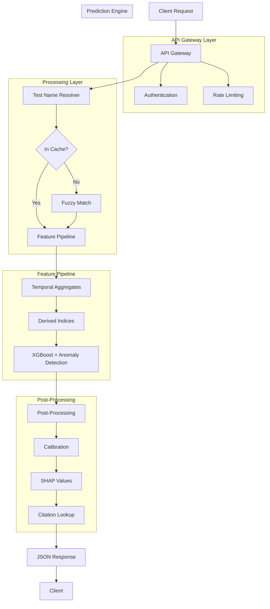

# 🔬 LabDx: Diagnostic API for Hemoglobinopathy Detection

LabDx is a proof-of-concept diagnostic API that analyzes longitudinal laboratory results and returns a ranked differential diagnosis with confidence scores, SHAP feature attribution, and peer-reviewed citations. This repository demonstrates the architecture, feature engineering pipeline, and public data training examples for a hemoglobinopathy detection model.

**Important Disclaimer:** This is a demonstration project only. The model shown here is trained on public NHANES data with proxy labels and is **not validated for clinical use**. Proprietary model weights and MIMIC-IV data are not included in this repository.

---

## 🚩 Problem Statement

Physicians have more laboratory data than ever, yet diagnostic delays remain common. Medical errors account for 251,000 deaths annually. Existing clinical decision support tools require symptoms or suspected diagnoses as input. None work from laboratory data alone or analyze longitudinal trends.

This API addresses that gap by synthesizing existing lab data to reveal diagnostic patterns, temporal trends, and anomalies that do not match common conditions.

---

## 🎯 Vision: Connecting Disconnected Dots

"No one is talking. The giant is suffering. And no one even notices, because they are all too busy managing their own small piece of the rope." -Jonathan Swift

Healthcare  has become entrapped in the twine of isolated specialists. Much like Swift's giant, the rheumatologists have ensnared the hands in a treatment that pulls at the stomach, while the head is restricted by the neurologist that can't see the feet.

Finding a physician that is multi-disciplinary is extremely rare, and even then, it is difficult for one person to know all the ways the body is connected.

This project is motivated by a lifetime of experiencing the healthcare disconnect. From being misdiagnosed with leukemia at 7, chronic pain that started at 14, unexplained recurrent miscarriages at 37, to the final long overdue diagnosis at 42. Healthcare has failed many, but maybe it doesn't have to fail our future?

This API starts with hemoglobinopathies. However, the architecture is designed to build and recognize patterns across specialties and to see the signals hidden in the noise and weave the dots that so often go unconnected.

---

## 🧩 What This API Does

| Feature | Description |
|---------|-------------|
| Lab-result-driven diagnosis | No symptoms or suspected diagnosis required |
| Longitudinal trend analysis | Calculates slopes, acceleration, and variability over 3-12 months |
| Transparent predictions | SHAP values show why each diagnosis was suggested |
| Rare disease flagging | Anomaly detection identifies unrecognized patterns |
| FHIR native | Accepts FHIR R4 bundles for EHR integration |
| Evidence-cited | Every diagnosis includes peer-reviewed citations |

---

## 🧬 Target Conditions (Pilot Scope)

| Condition | Prevalence | Key Lab Markers |
|-----------|------------|-----------------|
| Beta-thalassemia trait | 1-20% globally | Low MCV, normal/elevated RBC, normal ferritin |
| Iron deficiency anemia | 5-10% | Low MCV, low ferritin, high RDW |
| Sickle cell trait/disease | 1-40% endemic | Low Hb, HbS on electrophoresis |
| HbE trait | 10-60% SE Asia | Low MCV, low MCH, HbE peak |

---

## Success Metrics (Pilot)

The pilot phase targets hemoglobinopathies (beta-thalassemia trait, sickle cell disease/trait, HbE trait, and iron deficiency anemia). Success is defined by the following quantifiable metrics:

### Model Performance

| Metric | Target | Measurement |
|--------|--------|-------------|
| AUC (common conditions) | >0.90 | Area under ROC curve for beta-thalassemia and sickle cell |
| AUC (rare variants) | >0.85 | Area under ROC curve for HbE trait |
| Calibration slope | 0.8 - 1.2 | Calibration curve slope (ideal = 1.0) |
| Calibration intercept | <0.1 | Calibration curve intercept (ideal = 0) |
| External validation drop | <15% | Performance drop from internal to external validation |
| Net benefit at 10% threshold | >0.02 | Decision curve analysis net benefit |

### Go/No-Go Decision

Proceed to Phase 2 (expansion to additional hematologic conditions) only if ALL model performance metrics meet or exceed minimum acceptable thresholds. See [Roadmap](docs/roadmap.md)

If metrics not met, publish negative results and pivot to alternative architecture or different initial condition.

## 🏗 Technical Architecture


---
## 🔐 Authentication

The API uses API key authentication. All requests to protected endpoints must include the API key in the request header.

### Getting an API Key

For demonstration purposes, the API key is stored in a `.env` file. To run the API locally:

1. Create a `.env` file in the project root
2. Add your API key: `LABDX_API_KEY=your-api-key-here`
3. The API will load the key automatically using `python-dotenv`

### Making Authenticated Requests

Include the API key in the `X-API-Key` header for all requests.
---

## 🥽 Unit Tests

This project includes unit tests for the test name resolver, feature extraction, citation lookup, and API endpoints.

### Install Development Dependencies

```bash
pip install -r requirements-dev.txt
```
### Run All Tests

```bash
pytest test_labdx.py -v
```
## Model Performance (MIMIC-IV Validation)

| Metric | Value |
|--------|-------|
| AUC | 0.9101 |
| Sensitivity | 100% |
| Specificity | 97.59% |
| Optimal Threshold | 0.6152 |
| Test set size | 496 patients (140 cases, 356 controls) |