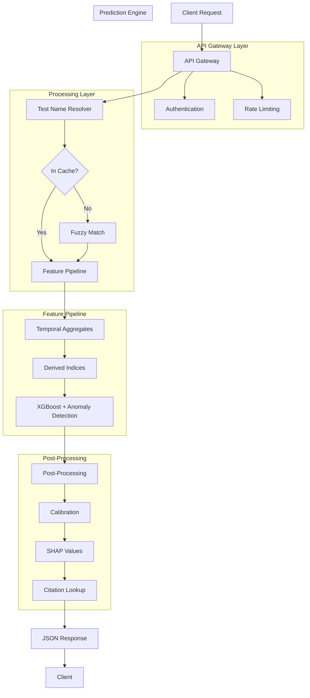
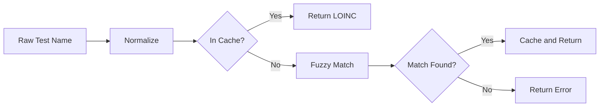
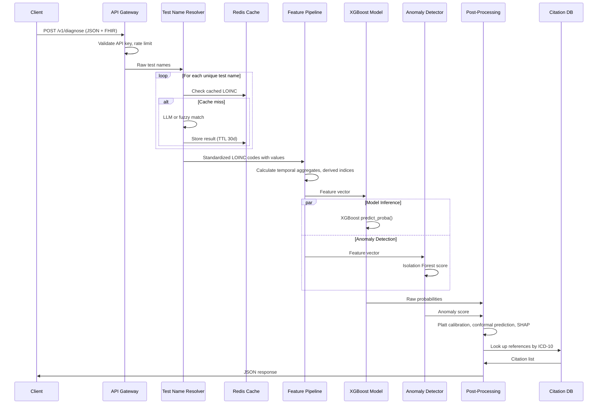

# LabDx Architecture Documentation

## Overview

LabDx is a diagnostic API that analyzes longitudinal laboratory data to generate differential diagnoses. The architecture follows a modular pipeline design with six primary layers: API Gateway, Test Name Resolver, Feature Pipeline, Prediction Engine, Post-Processing, and Response Formatter.

## High-Level Architecture Diagram



## Layer Descriptions

### 1. API Gateway Layer

The entry point for all client requests. Handles authentication, rate limiting, and request validation.
| Component	| Purpose | Implementation |
| --------- | ------- | -------------- |
| Authentication | 	Verify API key | 	FastAPI | 
| Rate Limiting | Prevent abuse and ensure fair usage	| 100 requests per minute per API key| 
| Request Validation	| Validate JSON schema against Pydantic models	| FastAPI + Pydantic| 

**TODO: Add authentication layer**

### 2. Test Name Resolver

The resolver uses exact matching and fuzzy matching (with 80% threshold) to convert free-text test names ("CBC", "complete blood count") to LOINC codes. Results are cached in memory for performance.

**Current Caching Strategy:**
* Cache TTL: Unlimited 
* Cache key: normalized test name (lowercase, stripped)
* Cache store: In-memory Python dictionary 

**Future Caching Strategy:**
* Cache TTL: 30 days
* Cache key: normalized test name (lowercase, stripped)
* Cache store: Redis

**Fallback Chain:**
* Exact match against canonical list
* Fuzzy match against synonyms (80% threshold)
* Fuzzy match against canonical names (70% threshold)
* Return error with message indicating test name could not be resolved

**Future additions:**
* LLM resolution (GPT-3.5 or local Llama)
* Redis for caching

### 3. Feature Pipeline

Converts raw lab data into a fixed-dimension feature vector for the model.

**Input Data Structure:**
JSON Example
```
{
  "patient_id": "P001",
  "patient": {
    "birth_year": 1975,
    "sex": "F"
  },
  "lab_history": [
    {
      "date": "2024-01-15",
      "test_name": "hemoglobin",
      "value": 12.1,
      "unit": "g/dL",
      "loinc_code": "718-7"
    },
    {
      "date": "2024-06-20",
      "test_name": "hemoglobin",
      "value": 11.4,
      "unit": "g/dL"
    }
  ]
}
```

FHIR R4 bundle (US Core 6.1.0) Example
```
{
  "resourceType": "Bundle",
  "type": "collection",
  "entry": [
    {
      "resource": {
        "resourceType": "Patient",
        "birthDate": "1975",
        "gender": "female"
      }
    },
    {
      "resource": {
        "resourceType": "DiagnosticReport",
        "status": "final",
        "category": [
          {
            "coding": [
              {
                "system": "http://terminology.hl7.org/CodeSystem/v2-0074",
                "code": "LAB"
              }
            ]
          }
        ],
        "code": {
          "coding": [
            {
              "system": "http://loinc.org",
              "code": "58410-2",
              "display": "Complete blood count panel"
            }
          ]
        },
        "subject": {"reference": "urn:uuid:patient-1"},
        "effectiveDateTime": "2024-06-20T08:30:00-04:00",
        "result": [
          {"reference": "urn:uuid:obs-hgb"},
          {"reference": "urn:uuid:obs-mcv"}
        ]
      }
    },
    {
      "resource": {
        "resourceType": "Observation",
        "id": "obs-hgb",
        "status": "final",
        "code": {
          "coding": [
            {
              "system": "http://loinc.org",
              "code": "718-7",
              "display": "Hemoglobin"
            }
          ]
        },
        "valueQuantity": {
          "value": 11.4,
          "unit": "g/dL"
        },
        "effectiveDateTime": "2024-06-20T08:30:00-04:00"
      }
    },
    {
      "resource": {
        "resourceType": "Observation",
        "id": "obs-mcv",
        "status": "final",
        "code": {
          "coding": [
            {
              "system": "http://loinc.org",
              "code": "787-2",
              "display": "MCV"
            }
          ]
        },
        "valueQuantity": {
          "value": 70,
          "unit": "fL"
        },
        "effectiveDateTime": "2024-06-20T08:30:00-04:00"
      }
    }
  ]
}
```

#### Feature Categories:


#### Current Implementation (v1.0)

| Category | Features | Count |
|----------|----------|-------|
| CBC Parameters | Hemoglobin, MCV, RBC, RDW | 4 |
| Derived Indices | Mentzer index, Green & King, England & Fraser, Srivastava index| 4 |
| Clinical Context | Age, sex | 2 |
| **Total** | | **10** |

##### Derived Index Formulas:
| Index |	Formula |	Clinical Use |
| ----- | ------- | ------------ |
|Mentzer Index |	MCV / RBC	<13  | suggests thalassemia trait|
|Green & King Index |	(MCV^2 * RDW) / (Hb * 100) |	Elevated in iron deficiency|
|England & Fraser Index |	MCV - RBC - (5 * Hb) - 8.4	>0 | suggests thalassemia trait|

#### Roadmap (v2.0 and beyond)

| Category | Features | Count | Status |
|----------|----------|-------|--------|
| CBC Parameters | MCH, MCHC, platelets, WBC | 4 | Planned |
| Temporal Slopes | 3/6/12-month slopes for Hb, MCV | 6 | Planned |
| Temporal Variability | Standard deviation, CV | 2 | Planned |
| Clinical Context | Pregnancy, medication flags | 2 | Considered |
| Missing Indicators | Binary flags per lab per timepoint | Up to 7 | Considered |


**Temporal Feature Calculation:**

For each patient with at least two measurements separated by at least 30 days:
```
slope = (value_latest - value_earliest) / (days_difference / 30.44)
```
Where 30.44 is average days per month.

### 4. Prediction Engine

The core ML component. Runs XGBoost inference and anomaly detection.

### Current Model (v1.0 - Demonstration)

| Parameter | Value |
|-----------|-------|
| Algorithm | DummyModel (rule-based) |
| Features | 10 (Hb, MCV, RBC, RDW, Mentzer index, age, sex) |
| Inference speed | <50ms |

### Target Model (v2.0 - After MIMIC-IV)

| Parameter | Value |
|-----------|-------|
| Algorithm | XGBoost 2.0+ |
| Features | ~30 (CBC + temporal slopes + derived indices) |
| Training data | MIMIC-IV + NHANES |
| Inference speed | <100ms |


#### Anomaly Detection (Future Planned Addition):
* Algorithm: Isolation Forest
* Contamination: 0.05 (expect 5% of patterns to be unusual)
* Output: Anomaly score (0 to 1)
* Threshold: >0.75 triggers "unrecognized pattern" flag

#### Rare Disease Retriever ((Future Planned Addition)):
* Method: k-Nearest Neighbors (k=3)
* Search space: Case report database (PubMed Central)
* Similarity metric: Cosine similarity on lab feature vectors

### 5. Post-Processing (Post MIMIC-IV)

Refines raw model outputs into clinically useful predictions.

#### Calibration (Platt Scaling):
```
from sklearn.calibration import CalibratedClassifierCV
calibrated_model = CalibratedClassifierCV(model, method='platt', cv=5)
```
Converts raw XGBoost scores (0 to 1 but not well-calibrated) to true probabilities.

#### Confidence Intervals (Conformal Prediction):
* Method: Split conformal prediction
* Coverage target: 90%
* Output: [lower_bound, upper_bound] for each diagnosis

#### SHAP Values:
```
import shap
explainer = shap.TreeExplainer(model)
shap_values = explainer.shap_values(feature_vector)
````
Returns top 5 features that most influenced each prediction.

**Citation Lookup:**

Pre-indexed mapping from ICD-10 code to peer-reviewed references.

Example mapping:
```
"D56.3" -> [
  {"title": "Beta-thalassemia trait", "authors": "Taher et al.", "journal": "Lancet", "year": 2018, "doi": "10.1016/S0140-6736(18)30698-9"}
]
```

### 6. Response Formatter

Assembles final JSON response for the client.

Output Structure:
```
{
  "request_id": "req_20260604_abc123",
  "processing_time_ms": 847,
  "canonical_labs": [...],
  "potential_diagnoses": [
    {
      "diagnosis": "Beta-thalassemia trait",
      "icd10": "D56.3",
      "confidence": 0.78,
      "confidence_interval_lower": 0.71,
      "confidence_interval_upper": 0.85,
      "supporting_labs": ["microcytosis out of proportion to anemia"],
      "feature_contributions": [
        {"feature": "mentzer_index", "value": 12.5, "shap": 0.31}
      ],
      "citations": [
        {"reference": "Taher et al. (2018) Lancet", "doi": "10.1016/S0140-6736(18)30698-9"}
      ]
    }
  ],
  "anomaly_flag": false,
  "recommended_followup_tests": ["hemoglobin electrophoresis"]
}
```
**Data Flow** 


1. Client sends request to API Gateway
2. Gateway validates API key and rate limit
3. Test Name Resolver converts raw test names to LOINC codes
4. Feature Pipeline calculates temporal aggregates and derived indices
5. XGBoost model generates raw probabilities
6. Anomaly detector computes anomaly score
7. Post-Processing applies calibration, SHAP, and citation lookup
8. Response Formatter returns JSON to client

### Technology Stack Summary
| Layer	| Technology | Purpose| 
| ----- | --------- | ------|
| API Framework	| FastAPI	| Async request handling| 
| ML Engine	| XGBoost	| Predictive modeling| 
| Cache	| Redis	| Test name caching| 
| FHIR Handling	| fhir.resources	| Resource validation| 
| LLM (optional)	| LiteLLM	| Test name resolution| 
| Deployment	| Docker and Kubernetes	| Container orchestration| 

### Security and Compliance
| Concern	| Implementation| 
| ---- | --- |
| Authentication	| API key plus JWT| 
| Data in transit	| TLS 1.3| 
| PHI handling	| De-identification before processing| 
| Audit logging	| All requests logged with request_id| 
| HIPAA	| Business Associate Agreements with cloud providers| 

### Scalability Considerations
| Component	| Scaling Strategy| 
| --- | --- |
| API Instances	| Horizontal scaling based on CPU above 70 percent| 
| Redis Cache	| Cluster mode for high availability| 
| Model Inference	| Less than 100ms per request, no GPU needed| 
| Database	| Read replicas for logs and analytics| 

### Failure Handling
| Failure Mode	| Mitigation| 
| --- | --- |
| LLM timeout	| Fallback to fuzzy matching| 
| Cache unavailable	| Direct to LLM (slower but works)| 
| Model load failure	| Health check fails, instance removed from load balancer| 
| Invalid FHIR bundle	| Return 400 with validation errors| 
