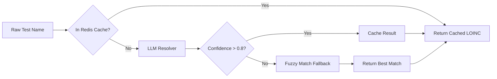
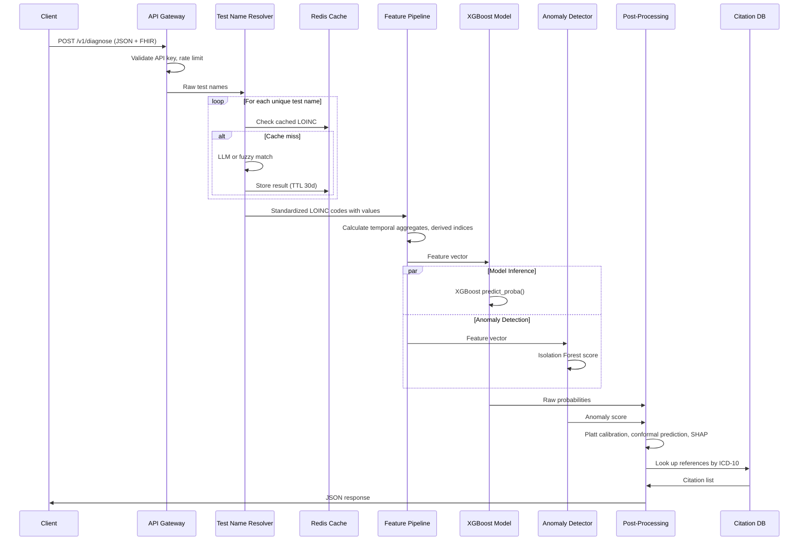

# LabDx Architecture Documentation

## Overview

LabDx is a diagnostic API that analyzes longitudinal laboratory data to generate differential diagnoses. The architecture follows a modular pipeline design with six primary layers: API Gateway, Test Name Resolver, Feature Pipeline, Prediction Engine, Post-Processing, and Response Formatter.

## High-Level Architecture Diagram


## Layer Descriptions

### 1. API Gateway Layer

The entry point for all client requests. Handles authentication, rate limiting, and request validation.
| Component	| Purpose | Implementation |
| --------- | ------- | -------------- |
| Authentication | 	Verify API key and JWT token | 	OAuth 2.0 / API Key| 
| Rate Limiting | Prevent abuse and ensure fair usage	| 100 requests per minute per API key| 
| Request Validation	| Validate JSON schema against Pydantic models	| FastAPI + Pydantic| 

### 2. Test Name Resolver

Converts free-text test names (e.g., "CBC", "complete blood count") to standardized LOINC codes.

**Caching Strategy:**
* Cache TTL: 30 days
* Cache key: normalized test name (lowercase, stripped)
* Cache store: Redis

**Fallback Chain:**
* Exact match against canonical list
* Fuzzy match using rapidfuzz (token sort ratio)
* LLM resolution (GPT-3.5 or local Llama)
* Return error with suggestion

### 3. Feature Pipeline

Converts raw lab data into a fixed-dimension feature vector for the model.

**Input Data Structure:**
```
{
  "patient_id": "P001",
  "lab_history": [
    {"date": "2024-01-15", "loinc": "718-7", "value": 12.1, "unit": "g/dL"},
    {"date": "2024-06-20", "loinc": "718-7", "value": 11.4, "unit": "g/dL"}
  ]
}
```

#### Feature Categories:
| Category	| Features | Count |
| --------  | -------- | ----- |
|CBC Parameters |	Hemoglobin, MCV, MCH, RBC, RDW, platelets, WBC |	7|
|Derived Indices |	Mentzer index, Green & King, England & Fraser	| 3|
|Temporal Slopes |	3-month, 6-month, 12-month slopes for hemoglobin, MCV |	6|
|Temporal Variability |	Standard deviation, coefficient of variation |	2|
|Clinical Context |	Age, sex, pregnancy status |	3|
|Missing Indicators |	Binary flags for each lab at each timepoint |	7|
|Total Feature Vector | |	28-50 (varies by available data)|

#### Derived Index Formulas:
| Index |	Formula |	Clinical Use |
| ----- | ------- | ------------ |
|Mentzer Index |	MCV / RBC	<13  | suggests thalassemia trait|
|Green & King Index |	(MCV^2 * RDW) / (Hb * 100) |	Elevated in iron deficiency|
|England & Fraser Index |	MCV - RBC - (5 * Hb) - 8.4	>0 | suggests thalassemia trait|

**Temporal Feature Calculation:**

For each patient with at least two measurements separated by at least 30 days:
```
slope = (value_latest - value_earliest) / (days_difference / 30.44)
```
Where 30.44 is average days per month.

### 4. Prediction Engine

The core ML component. Runs XGBoost inference and anomaly detection.

#### XGBoost Model:
| Parameter | Value |	Rationale |
| --------- | ----- | --------- |
| Algorithm	| XGBoost 2.0+	| Best for tabular data, handles missing values| 
| Task	| Multi-label classification	| One patient may have multiple conditions| 
| Output	| Probability per condition (0 to 1)	| Calibrated via Platt scaling| 
| Training data	| MIMIC-IV + NHANES |	Real-world ICU + outpatient| 
| Features	| ~50 numeric features |	Derived from CBC and temporal analysis| 
| Inference speed	| <100ms per request	| On t4g.small instance| 

#### Anomaly Detection:
* Algorithm: Isolation Forest
* Contamination: 0.05 (expect 5% of patterns to be unusual)
* Output: Anomaly score (0 to 1)
* Threshold: >0.75 triggers "unrecognized pattern" flag

#### Rare Disease Retriever (if anomaly flagged):
* Method: k-Nearest Neighbors (k=3)
* Search space: Case report database (PubMed Central)
* Similarity metric: Cosine similarity on lab feature vectors

### 5. Post-Processing

Refines raw model outputs into clinically useful predictions.

#### Calibration (Platt Scaling):
```
from sklearn.calibration import CalibratedClassifierCV
calibrated_model = CalibratedClassifierCV(model, method='platt', cv=5)
```
Converts raw XGBoost scores (0 to 1 but not well-calibrated) to true probabilities.

#### Confidence Intervals (Conformal Prediction):
* Method: Split conformal prediction
* Coverage target: 90%
* Output: [lower_bound, upper_bound] for each diagnosis

#### SHAP Values:
```
import shap
explainer = shap.TreeExplainer(model)
shap_values = explainer.shap_values(feature_vector)
````
Returns top 5 features that most influenced each prediction.

**Citation Lookup:**

Pre-indexed mapping from ICD-10 code to peer-reviewed references.

Example mapping:
```
"D56.3" -> [
  {"title": "Beta-thalassemia trait", "authors": "Taher et al.", "journal": "Lancet", "year": 2018, "doi": "10.1016/S0140-6736(18)30698-9"}
]
```

### 6. Response Formatter

Assembles final JSON response for the client.

Output Structure:
```
{
  "request_id": "req_20260604_abc123",
  "processing_time_ms": 847,
  "canonical_labs": [...],
  "potential_diagnoses": [
    {
      "diagnosis": "Beta-thalassemia trait",
      "icd10": "D56.3",
      "confidence": 0.78,
      "confidence_interval_lower": 0.71,
      "confidence_interval_upper": 0.85,
      "supporting_labs": ["microcytosis out of proportion to anemia"],
      "feature_contributions": [
        {"feature": "mentzer_index", "value": 12.5, "shap": 0.31}
      ],
      "citations": [
        {"reference": "Taher et al. (2018) Lancet", "doi": "10.1016/S0140-6736(18)30698-9"}
      ]
    }
  ],
  "anomaly_flag": false,
  "recommended_followup_tests": ["hemoglobin electrophoresis"]
}
```
**Data Flow** 

